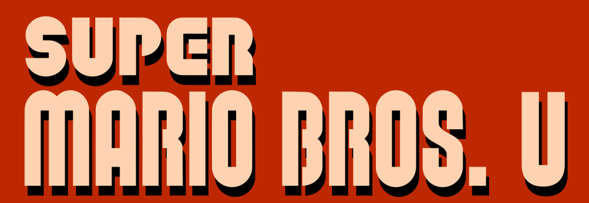

---
# Feel free to add content and custom Front Matter to this file.
# To modify the layout, see https://jekyllrb.com/docs/themes/#overriding-theme-defaults

layout: default
---

# 

## Leikreglur

Markmiðið í leiknum er að klára borðið og komast að fánastönginni. Á leiðinni eru óvinir sem þarf að vara sig á. Hægt er að hoppa á þá til að drepa þá en ef maður rekst á þá deyr maður sjálfur.

Maður byrjar með 5 líf. Ef maður missir þau öll er leiknum lokið. Spurningakassar eru dreifðir um borðið og úr þeim er hægt að fá peninga. Nái maður 10 peningum fær maður aukalíf.

## Stjórn

Hreyfa leikmann: <kbd>Örvatakkar</kbd> eða <kbd>WASD<kbd>

Hoppa: <kbd>Bilstöng (Space)</kbd>

Hlaupa: <kbd>Left Shift</kbd>

Hætta: <kbd>Escape</kbd>

## Myndband af leik

<video style="width: 100%" src="gameplay.mp4" controls></video>

## Sækja leik

Hægt er að sækja spilanlegan leik fyrir Windows og macOS í [Releases á GitHub](https://github.com/reyniraron/forr2gl-verkefni-5/releases).
